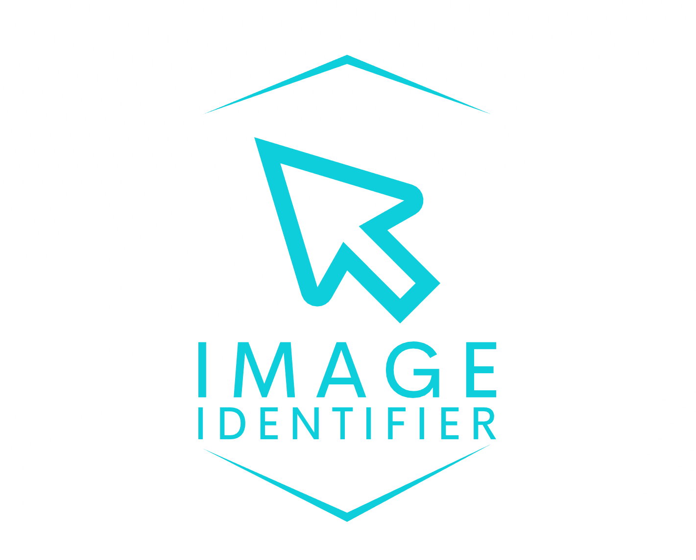
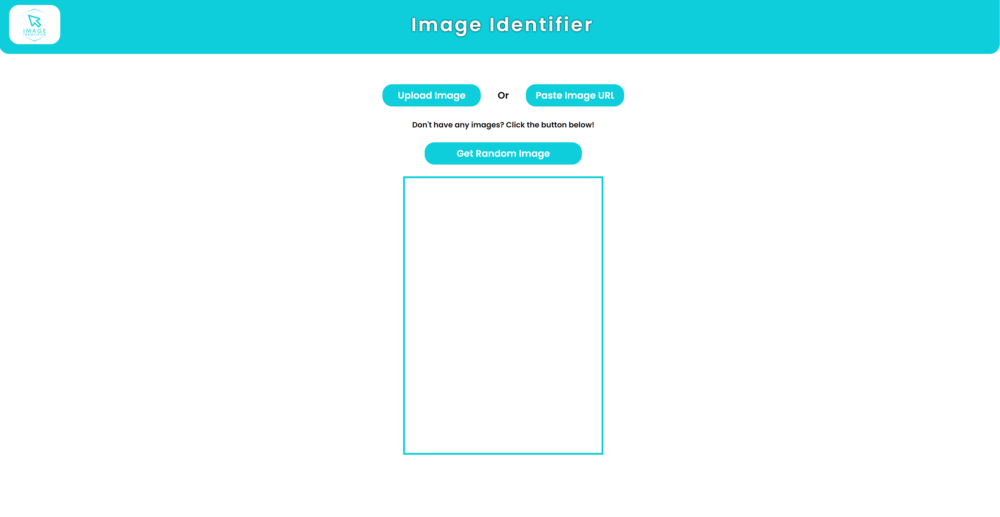
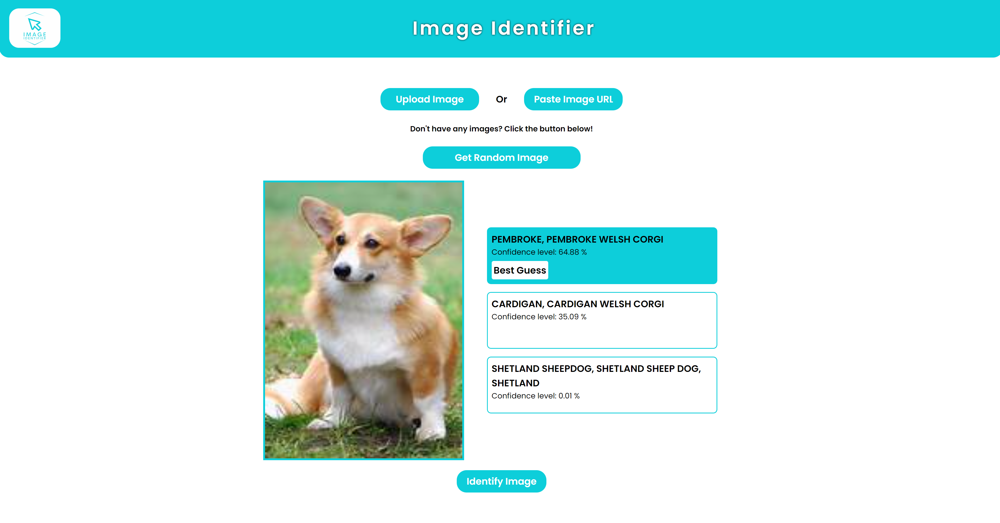

# Image Identifier

This project is a react application that utilizes tensorflow.js to identify images. The user can upload an image of their own, paste an 
image url, or generate a random image using Unsplash's random image API.
The application will then generate 3 guesses on what the image could be and display the results. Each image will then be saved at the bottom of the page for future reference.

## Deployed Application

[Image Identifier](https://deluxe-dolphin-05bfc4.netlify.app/)

## Table of Contents

* [Dependencies/Technologies Used](#dependencies/technologies-used)
* [Installation](#installation)
* [Usage](#usage)
* [Contributing](#contributing)
* [License](#license)
* [Tests](#tests)
* [Questions](#questions)

## Dependencies/Technologies Used

* [JavaScript](https://www.javascript.com/)
* [Node](https://www.nodejs.org/)
* [React](https://reactjs.org/)
* [Styled-Components](https://styled-components.com/)
* [Tensorflow.js](https://www.tensorflow.org/js)
* [@tensorflow-models/mobilenet](https://www.npmjs.com/package/@tensorflow-models/mobilenet)
* [Craco](https://www.npmjs.com/package/craco)
* [Unsplash API](https://unsplash.com/developers)

## Usage

After the loads, the user is presented with an empty image frame and 3 options to choose from. The user can either upload an image of their own, paste an image url, or generate a random image using Unsplash's random image API.

 

 

Once the user has selected an image, the application will displayed inside of the image feame. However, the image may not always fit inside of the frame perfectly depending on the dimensions of the image, but it will be centered inside of the frame. Once the image is loaded inside of the frame, the user can preview the image and click the "identify image" button to have the application identify the image. The application will then generate 3 guesses on what the image could be and display the results. 

 

 

Each image will then be saved at the bottom of the page for future reference.

 

 

## Installation

In order to install this application, you will need to clone the repository onto your local machine. Once cloned, you will need to run `npm install` in order to install all of the dependencies. Once the dependencies are installed, you can run `npm start` to start the application.

## Contributing

We are not currently accepting contributors at the moment.

## License

## Tests

There are currently no unit tests implemented yet.

## Questions

If you have any questions, feature requests, or want to report a bug, please contact me at one of the following locations:

* Github: [MasonBoom](github.com/MasonBoom)
* Email: masonboom@gmail.com
* LinkedIn: [Mason Boomgaard](https://www.linkedin.com/in/mason-boomgaard/)
